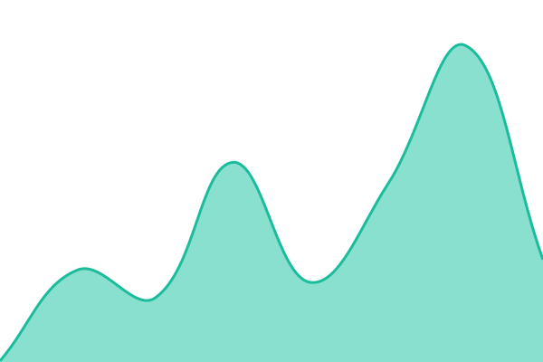
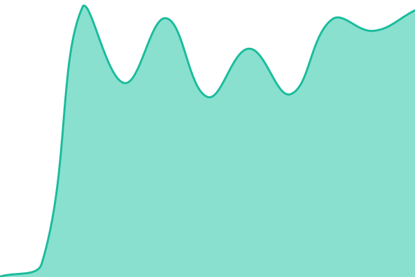

# [📈 Live Status](https://status.mrzsomi.top): <!--live status--> **🟩 All systems operational**

This repository contains the open-source uptime monitor and status page for [mrzsomi](https://status.mrzsomi.top), powered by [Upptime](https://github.com/upptime/upptime).

With [Upptime](https://upptime.js.org), you can get your own unlimited and free uptime monitor and status page, powered entirely by a GitHub repository. We use [Issues](https://github.com/SajtosZsomle/status-page/issues) as incident reports, [Actions](https://github.com/SajtosZsomle/status-page/actions) as uptime monitors, and [Pages](https://status.mrzsomi.top) for the status page.

<!--start: status pages-->
<!-- This summary is generated by Upptime (https://github.com/upptime/upptime) -->
<!-- Do not edit this manually, your changes will be overwritten -->
<!-- prettier-ignore -->
| URL | Status | History | Response Time | Uptime |
| --- | ------ | ------- | ------------- | ------ |
|  [MrZsomi.top](https://mrzsomi.top) | 🟩 Up | [mr-zsomi-top.yml](https://github.com/SajtosZsomle/status-page/commits/HEAD/history/mr-zsomi-top.yml) | 

 152ms
     
 | 

<a href="https://status.mrzsomi.top/history/mr-zsomi-top">100.00%</a>
    

|  [Proxmox Node 1](https://pve.mrzsomi.top) | 🟩 Up | [proxmox-node-1.yml](https://github.com/SajtosZsomle/status-page/commits/HEAD/history/proxmox-node-1.yml) | 

 552ms
     
 | 

<a href="https://status.mrzsomi.top/history/proxmox-node-1">100.00%</a>
    

|  [Proxmox Node 2](https://pve2.mrzsomi.top) | 🟩 Up | [proxmox-node-2.yml](https://github.com/SajtosZsomle/status-page/commits/HEAD/history/proxmox-node-2.yml) | 

 533ms
     
 | 

<a href="https://status.mrzsomi.top/history/proxmox-node-2">100.00%</a>
    

<!--end: status pages-->

[**Visit our status website →**](https://status.mrzsomi.top)

## 📄 License

- Powered by: [Upptime](https://github.com/upptime/upptime)
- Code: [MIT](./LICENSE) © [Anand Chowdhary](https://anandchowdhary.com)
- Data in the `./history` directory: [Open Database License](https://opendatacommons.org/licenses/odbl/1-0/)
