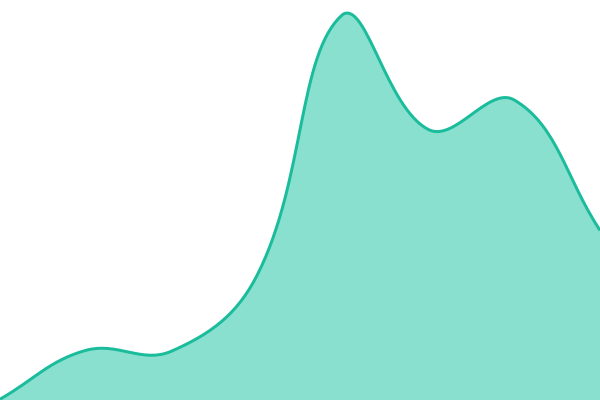

# [📈 Live Status](https://status.mrzsomi.top): <!--live status--> **🟧 Partial outage**

This repository contains the open-source uptime monitor and status page for [mrzsomi](https://status.mrzsomi.top), powered by [Upptime](https://github.com/upptime/upptime).

With [Upptime](https://upptime.js.org), you can get your own unlimited and free uptime monitor and status page, powered entirely by a GitHub repository. We use [Issues](https://github.com/SajtosZsomle/status-page/issues) as incident reports, [Actions](https://github.com/SajtosZsomle/status-page/actions) as uptime monitors, and [Pages](https://status.mrzsomi.top) for the status page.

<!--start: status pages-->
<!-- This summary is generated by Upptime (https://github.com/upptime/upptime) -->
<!-- Do not edit this manually, your changes will be overwritten -->
<!-- prettier-ignore -->
| URL | Status | History | Response Time | Uptime |
| --- | ------ | ------- | ------------- | ------ |
|  [MrZsomi.top](https://mrzsomi.top) | 🟩 Up | [mr-zsomi-top.yml](https://github.com/SajtosZsomle/status-page/commits/HEAD/history/mr-zsomi-top.yml) | 

 184ms
     
 | 

<a href="https://status.mrzsomi.top/history/mr-zsomi-top">100.00%</a>
    

|  [Game Assets Directory](https://game.mrzsomi.top) | 🟩 Up | [game-assets-directory.yml](https://github.com/SajtosZsomle/status-page/commits/HEAD/history/game-assets-directory.yml) | 

 196ms
     
 | 

<a href="https://status.mrzsomi.top/history/game-assets-directory">100.00%</a>
    

|  [Vladis Bot Website](https://vladis.mrzsomi.top) | 🟩 Up | [vladis-bot-website.yml](https://github.com/SajtosZsomle/status-page/commits/HEAD/history/vladis-bot-website.yml) | 

 103ms
     
 | 

<a href="https://status.mrzsomi.top/history/vladis-bot-website">100.00%</a>
    

|  [Vladis Bot API](https://vladisapi.mrzsomi.top) | 🟥 Down | [vladis-bot-api.yml](https://github.com/SajtosZsomle/status-page/commits/HEAD/history/vladis-bot-api.yml) | 

 137ms
     
 | 

<a href="https://status.mrzsomi.top/history/vladis-bot-api">24.96%</a>
    

|  [Component Inventory](https://inv.mrzsomi.top) | 🟩 Up | [component-inventory.yml](https://github.com/SajtosZsomle/status-page/commits/HEAD/history/component-inventory.yml) | 

 85ms
     
 | 

<a href="https://status.mrzsomi.top/history/component-inventory">100.00%</a>
    

|  [Component Inventory API](https://api.inv.mrzsomi.top) | 🟥 Down | [component-inventory-api.yml](https://github.com/SajtosZsomle/status-page/commits/HEAD/history/component-inventory-api.yml) | 

 362ms
     
 | 

<a href="https://status.mrzsomi.top/history/component-inventory-api">34.28%</a>
    

|  [AutoAI](https://auto.mrzsomi.top) | 🟩 Up | [auto-ai.yml](https://github.com/SajtosZsomle/status-page/commits/HEAD/history/auto-ai.yml) | 

 84ms
     
 | 

<a href="https://status.mrzsomi.top/history/auto-ai">100.00%</a>
    

|  [AutoAI API](https://api.auto.mrzsomi.top) | 🟥 Down | [auto-ai-api.yml](https://github.com/SajtosZsomle/status-page/commits/HEAD/history/auto-ai-api.yml) | 

 173ms
     
 | 

<a href="https://status.mrzsomi.top/history/auto-ai-api">49.67%</a>
    

<!--end: status pages-->

[**Visit our status website →**](https://status.mrzsomi.top)

## 📄 License

- Powered by: [Upptime](https://github.com/upptime/upptime)
- Code: [MIT](./LICENSE) © [Anand Chowdhary](https://anandchowdhary.com)
- Data in the `./history` directory: [Open Database License](https://opendatacommons.org/licenses/odbl/1-0/)
